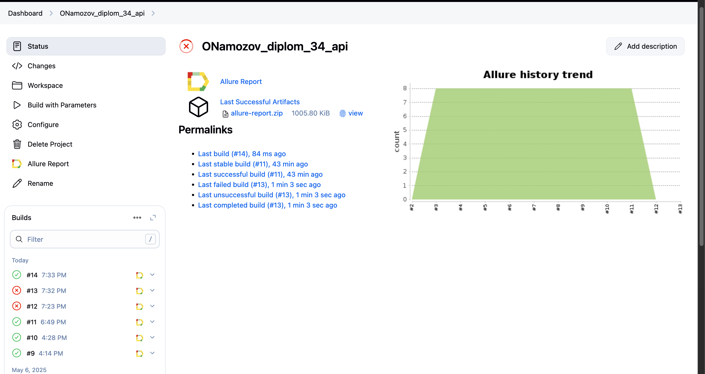
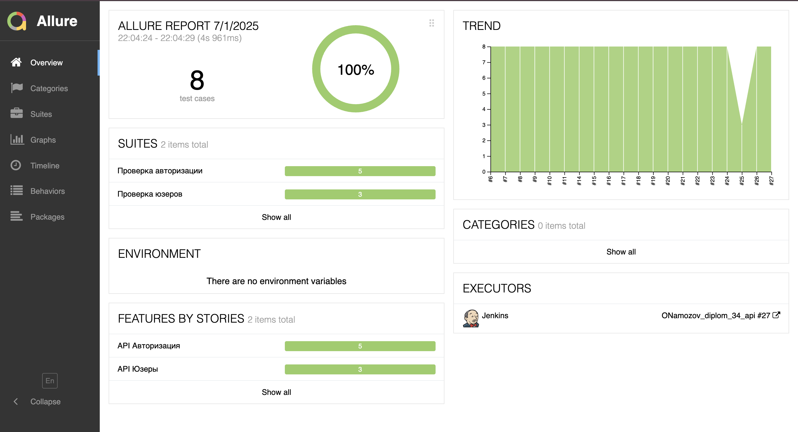
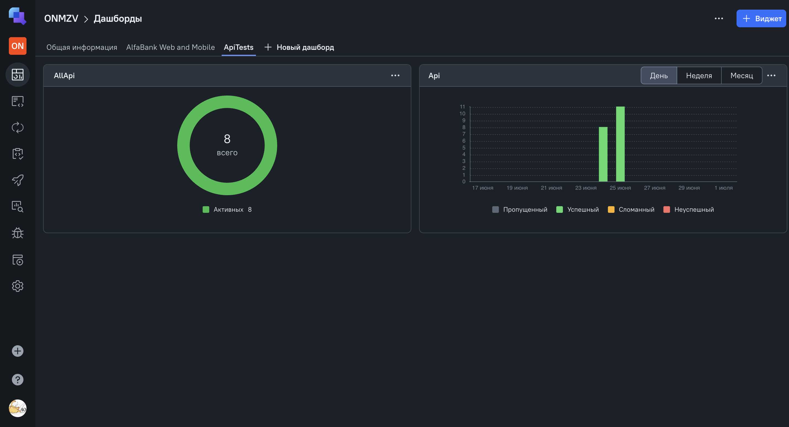
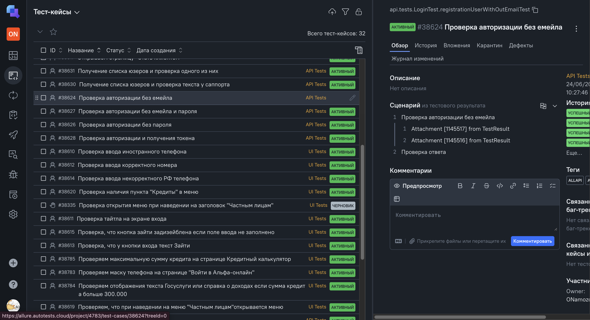
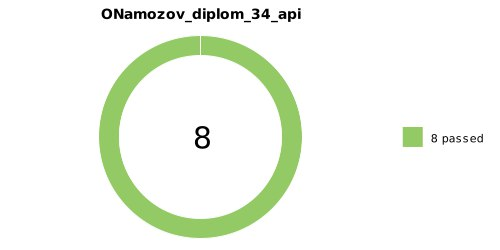

<a href="https://reqres.in/ ">  
<h1 >Проект по автоматизации тестирования для компании <a href="https://reqres.in/ "> Reqres</a></h1> 

## ☑️ Содержание:

- [Технологии и инструменты](#tools)
- [Реализованные проверки](#cases)
    - [Авторизация](#авторизация)
    - [Пользователи](#пользователи)
- [Сборка в Jenkins](#jenkins-build)
- [Команда для запуска из терминала](#команда-для-запуска-из-терминала)
- [Allure Report](#allure-report)
- [Allure TestOps](#allure-testops)
- [Уведомление в Telegram](#telegram)

<a id="tools"></a>
## :ballot_box_with_check:Технологии и инструменты:
<p align="center">
<a href="https://www.java.com/ru/"> 
<a href="https://github.com/allure-framework/"> 
<a href="https://gradle.org/"> 
<a href="https://junit.org/"> 
<a href="https://qameta.io/"> 
<a href="https://github.com/"> 
<a href="https://www.jenkins.io/"> 
<a href="https://telegram.org/"> 
<a href="https://rest-assured.io/"> 
</p>

<a id="cases"></a>
## :ballot_box_with_check: Реализованные проверки:

### Авторизация
- 🔑 Успешный вход и проверка токена
- 🔒 Неудачные попытки входа с невалидным эмейлом и паролем

### Пользователи
- ✅ Получение списка юзеров
- ✅ Сравнение данных из респонса
- ✅ Удаление юзера
- ✅ Пагинация
  
<a id="jenkins-build"></a>
##  Сборка в [Jenkins](https://jenkins.autotests.cloud/job/ONamozov_diplom_34_api/)


<p align="center">  
<a href="https://jenkins.autotests.cloud/job/ONamozov_diplom_34_api/">  </a>
</p>


## Команда для запуска из терминала
Локальный запуск
```bash
gradle clean AllApi
./gradlew AllApi
```

Удаленный запуск через Jenkins:
```bash  
clean AllApi
```
<a id="allure-report"></a>
## </a>  <a name="Allure"></a>[Allure Report](https://jenkins.autotests.cloud/job/ONamozov_diplom_34_api/27/allure/)	</a>


## Основная страница отчёта

<p align="center">
<a href="https://jenkins.autotests.cloud/job/ONamozov_diplom_34_api/27/allure/"> "  
</p>  

<a id="allure-testops"></a>
## </a>  <a name="Allure TestOps"></a>[Allure TestOps](https://allure.autotests.cloud/launch/47141)	</a>

<a id="allure-testops"></a>
## Основная страница отчёта [Allure TestOps](https://allure.autotests.cloud/launch/47141)

<p align="center">  
<a href="https://allure.autotests.cloud/launch/47141">   </a>
</p>  

## [Список](https://allure.autotests.cloud/project/4783/test-cases?treeId=0) тест-кейсов 
<p align="center">  
<a href="https://allure.autotests.cloud/project/4783/test-cases?treeId=0">   </a>
</p>

<a id="telegram"></a>
## </a> Уведомление в Telegram при помощи бота
____
<p align="center">  
  
</p>
